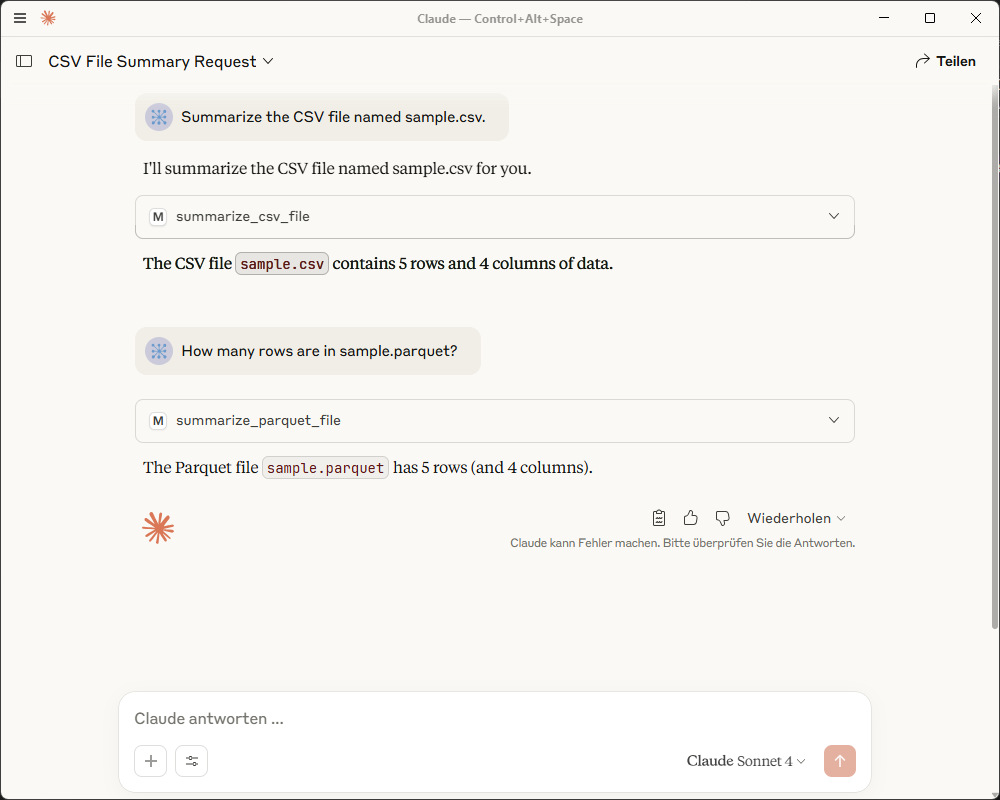

# MCP Server

Implements an example mcp serv as described
in [Building a Basic MCP Server with Python](https://medium.com/data-engineering-with-dremio/building-a-basic-mcp-server-with-python-4c34c41031ed)

```
uv add "mcp[cli]"
```

| `@mcp`     | |
|------------|-|
| `tool`     | |
| `resource` | |
| `prompt`   | |

## Claude Desktop Integration

```json
{
  "mcpServers": {
    "mix_server": {
      "command": "uv",
      "args": [
        "--directory",
        "/Users/gerri/Projekte/valantic-hackathon-2025/mcp-server",
        "run",
        "main.py"
      ]
    }
  }
}
```

How it works?

 